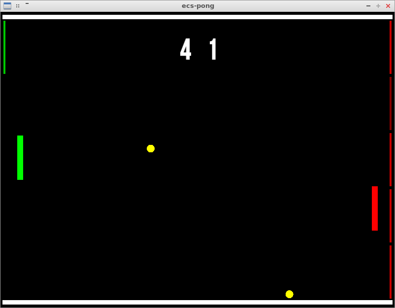

# ecs-pong
Pong game to practice [ECS](https://en.wikipedia.org/wiki/Entity%E2%80%93component%E2%80%93system) pattern, new [C++17](https://isocpp.org/files/papers/p0636r0.html) features, [SFML](https://www.sfml-dev.org/index.php) library and basic physics.

## Build and run
Build tool required: [scons](http://scons.org/)
```console
$ cd ecs-pong/
$ scons
$ ./ecs-pong
```



## Features
- Player bat controlled with user mouse
- Basic AI bat handling multiple balls
- Number of balls increases as game advance
- Brick walls behind player and AI bats
  - Destroyed on ball contact
  - Restored when scored on

## ECS
This little project proved me that the ECS pattern is really for game development, the extensibility is key.

#### Current model
Components (with fields):
```text
AI ()
Body (Circle (Radius) | Rectangle (Width, Height))
Bound (Min (X, Y), Max (X, Y))
Brick (With)
Contact (Normal (X, Y), TrueNormal (X, Y), Penetration, With)
Fade (Diff, Alpha)
Input ()
Movement (Velocity (X, Y))
Position (Coords (X, Y))
```

Entities (with components):
```text
Ball (Body, Movement, Position)
Bot (AI, Body, Bound, Position)
Player (Body, Bound, Input, Position)
Wall (Body, Position)
Brick (Body, Position, Brick)
```

Systems (with components and in order):
```text
Input (Input, Position)
AI (AI, Position)
Bound (Bound, Position)
Collision (Body, Movement, Position)
Impulse (Contact, Movement, Position)
Movement (Movement, Position)
Game (Movement, Position)
Fade (Body, Fade)
Render (Body, Position)
```

## Possible improvements
- Improve the AI behavior
- Add menus and game modes
- Add collision between balls
- Avoid collision tunneling
- And many more...
